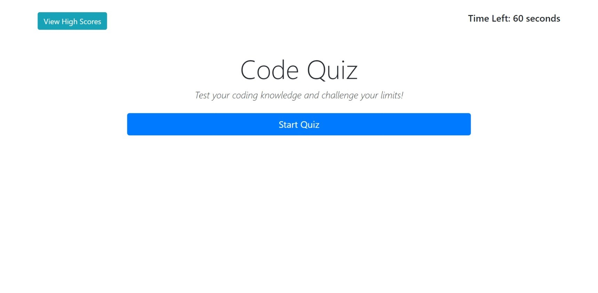

# Code Quiz

## Overview
The Code Quiz is a timed, multiple-choice quiz designed specifically for programmers. It's an engaging way to test your knowledge of programming languages, frameworks, and coding best practices. Whether you're a beginner or a seasoned developer, this quiz is a fun way to challenge yourself and reinforce your coding skills.

## Features
- **Timed Quiz**: Each session is timed to add a bit of pressure and simulate coding interviews.
- **Multiple Choice Questions**: Questions cover a range of programming topics.
- **Interactive UI**: A user-friendly interface with immediate feedback on answers.
- **Score Tracking**: Keep track of your scores and monitor your progress.
- **High Scores List**: Compete with others and try to get your name on the leaderboard!

## How to Play
1. **Start the Quiz**: Click the 'Start Quiz' button to begin.
2. **Answer Questions**: Choose the correct answer from the provided options for each question.
3. **Beat the Clock**: Answer correctly and quickly. Time is of the essence!
4. **View Your Score**: At the end of the quiz, see your score and check if you've made it to the high scores list.

## Link
[Code Quiz](https://robertsolorzano.github.io/Code-Quiz/)

## Preview

## Setup
To run this project locally:
1. Clone the repository to your local machine.
2. Open the `index.html` file in a web browser.

## Credits

[Bootstrap Documentation/Examples](https://getbootstrap.com/docs/5.3/examples/)
 
[Build a Quiz Application with HTML, CSS, and JavaScript | Step-by-Step Guide](https://www.codewithfaraz.com/content/161/build-a-quiz-application-with-html-css-and-javascript-step-by-step-guide)

## License
Refer to MIT Licence 

